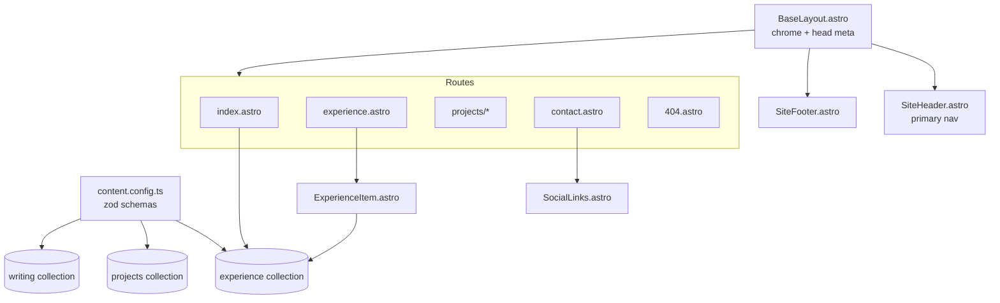
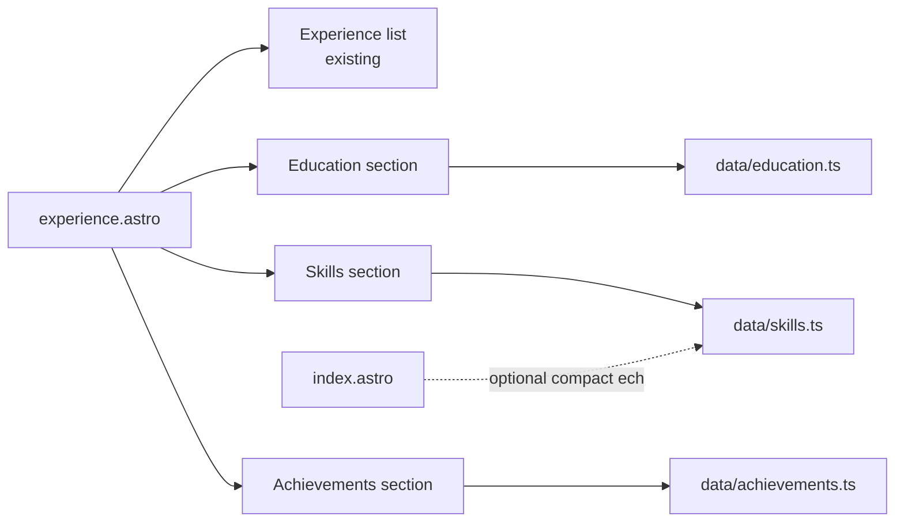

# Design Document

## Overview

This design brings the Ali Bonagdaran portfolio into faithful agreement with the authoritative resume at `public/resume.pdf`. It is a content and data alignment effort on an existing Astro 6 + TypeScript static site deployed to GitHub Pages — not a redesign. No new design system, framework, or visual identity is introduced. The work reuses the established component model (`.astro` components), the typed content collections defined in `src/content.config.ts`, Zod schemas, and the existing CSS class vocabulary in `src/styles/global.css`.

The design partitions the work into five change surfaces plus two cross-cutting artifacts:

1. **Experience alignment** — edit the five Markdown records (frontmatter + body) and skill tags so every title, company, location, date, and body fact matches the resume (R1–R6, R12).
2. **New résumé surfaces** — add Education, Skills, and Achievements content to the site (R7, R8, R9).
3. **Headline and identity copy** — reconcile home-page role copy and ensure name/location consistency across pages (R10).
4. **Contact reconciliation** — add `www.alibo.dev` as a labelled link, retaining email, LinkedIn, GitHub, and resume (R11).
5. **Product-constraint compliance** — no photograph, no elevation of Writing, no invented facts (R13).
6. **Alignment_Checklist** — a reviewable Markdown artifact in the spec folder mapping every required resume fact to its target location and verification status (R14).
7. **Verification** — `astro check && astro build` passing with zero errors, plus a content-presence verification approach (R14.6, R14.7).

### Resume facts (authoritative source of truth)

The following facts are extracted from `public/resume.pdf` as recorded in the requirements Glossary and criteria. The design treats these as canonical; where current site content differs, the resume wins.

| Area | Resume fact |
| --- | --- |
| Current role | Graduate DevOps Engineer, Australian Bureau of Statistics, Feb 2026 – Present |
| Cadet role | Cadet DevOps, Australian Bureau of Statistics, Mar 2025 – Feb 2026 |
| Banking role | Business Banking Associate, Commonwealth Bank of Australia, Redfern NSW, Nov 2024 – Jun 2025 |
| Service role | Customer & Digital Service Representative, Service NSW, Ryde NSW, Mar 2023 – Nov 2024 |
| Early role | Crew Member, McDonald's, Aug 2019 – Mar 2023 |
| Name / location | Ali Bonagdaran; Sydney, NSW |
| Education | Bachelor of Information Technology, University of Technology Sydney; WAM 82.58%, GPA 6.21, Distinction; major Enterprise Systems Development, sub-major Networking and Cybersecurity; 2023–2025 |
| Skills (6 categories) | Operating Systems, Languages, Cloud & DevOps, Containers & Orchestration, Tooling, Home lab (exact entries enumerated in R8) |
| Achievements | 2nd in NSW, Information Processes & Technology, 2022 HSC; AWS Certified Solutions Architect – Associate (in progress) |
| Personal site | www.alibo.dev |
| Email | alibonagdaran@gmail.com |

### Discrepancies identified during design (verified against current code)

| # | Location | Current value | Resume value | Resolution |
| --- | --- | --- | --- | --- |
| D1 | `abs-graduate-devops.md` title | `Graduate - DevOps Engineer` | `Graduate DevOps Engineer` | Edit frontmatter title (R1.2, R10.1) |
| D2 | `abs-cadet-devops.md` title | `Cadet - DevOps` | `Cadet DevOps` | Edit frontmatter title (R1.2) |
| D3 | `mcdonalds-crew-member.md` location | `Mount Colah, NSW` | not asserted by resume in R1 | Record as reconciliation decision in Alignment_Checklist; retain only if confirmed resume-supported, otherwise remove (R13.4, R13.5) |
| D4 | Graduate body | missing Copilot PoC; Jira migration areas not fully named | names Copilot PoC + three Jira areas | Rewrite body (R2.3, R2.4) |
| D5 | Cadet body | missing Jira/Sparx EA collaboration | names both tools | Rewrite body (R3.5) |
| D6 | Banking body | generic, no NPS/survey/complaint-routing facts | NPS > +70, high survey completion, complaint routing | Rewrite body (R4) |
| D7 | Service NSW body | generic | multi-agency, privacy legislation, complaint handling/resolution | Rewrite body (R5) |
| D8 | McDonald's body | generic | complaint resolution, < 140s drive-thru, teamwork | Rewrite body (R6) |
| D9 | All skills arrays | invented tags (Incident Triage, Problem Solving, etc.) | resume-vocabulary terms only | Reconcile each array (R12) |
| D10 | Education / Skills / Achievements | absent | present in resume | Add new surfaces (R7, R8, R9) |
| D11 | Contact page | no personal site | www.alibo.dev listed | Add labelled link (R11.3) — confirmed user decision |

### Typography rule: no em dashes or en dashes (user directive, overrides everything above)

The shipped site must contain zero em dashes (U+2014) and zero en dashes (U+2013), including HTML entities (`&mdash;`, `&ndash;`, `&#8212;`, `&#8211;`) and escapes, across `src/**`, `public/**`, `astro.config.mjs`, and the built `dist/` output.

- Date and year ranges use the word "to" (e.g. "Feb 2026 to Present", "2019 to Present") or a plain hyphen-minus "-" where space is tight. Pick one convention and apply it consistently site-wide.
- Titles and labels use a pipe, comma, or rewording (e.g. "Ali Bonagdaran | DevOps Engineer").
- Resume names that contain an en dash are rendered with a plain hyphen: "AWS Certified Solutions Architect - Associate". Record this in the Alignment_Checklist as a deliberate deviation from the resume.
- Prose is rewritten rather than given a substitute dash.
- Markdown smartypants must not produce either dash (avoid `--`/`---` in prose or disable smartypants dashes).

## Architecture

### Existing architecture (unchanged foundations)



### Design decision: where the new surfaces live

Three new résumé surfaces (Education, Skills, Achievements) are required. Two viable approaches were considered:

- **Option A — new routes** (`/education`, `/skills`, etc.) with new nav entries. Rejected: it inflates primary navigation for a lean site, fragments related résumé material across pages, and PRODUCT.md emphasizes keeping the experience lean and giving each route a distinct role. Three thin new routes dilute that.
- **Option B — new sections on the Experience page** (plus a compact Skills echo on Home where it strengthens first impression). Chosen: the Experience page is already the résumé-equivalent surface. Education, Skills, and Achievements are résumé facts that belong alongside work history, keep navigation unchanged (satisfying R13.2's spirit of not expanding surfaces unnecessarily), and let a visitor scan the full professional record in one place.

**Decision:** Education, Skills, and Achievements render as new `<section>` blocks appended to `src/pages/experience.astro`, below the existing experience list, each with its own labelled heading and reusing existing section/list CSS classes. No new routes, no `SiteHeader` nav changes.

### Design decision: typed content vs. inline/data modules

Each surface was assessed for whether a typed content collection adds value:

- **Education** — a single, stable record (one degree). A content collection (glob of Markdown files) is overkill for one entry and would add a directory and schema for no reuse. **Decision:** represent as a typed TypeScript data module `src/data/education.ts` exporting a typed `Education` object. This gives compile-time type safety via `astro check` without the ceremony of a collection.
- **Skills** — a fixed, ordered set of six categories with enumerated entries (R8). Order and exact membership are correctness-critical. **Decision:** typed data module `src/data/skills.ts` exporting an ordered `readonly` array of `{ category, entries }`. A `const`-typed structure makes the "exactly these entries, in this order" requirement reviewable in one file and type-checked.
- **Achievements** — a small fixed list with a status concept (certification "in progress"). **Decision:** typed data module `src/data/achievements.ts` exporting a typed `Achievement[]`, where a certification entry carries an explicit `status: "in progress"` field so R9.3/R9.4 (never shown as completed) are enforced structurally rather than by prose.

Rationale: these are small, singular, author-controlled datasets with no Markdown body needs. Typed data modules keep the site lean, remain fully type-checked by the existing `astro check` step, and avoid introducing collections that imply ongoing content authoring. Experience stays a content collection because it already is one and has Markdown bodies.



### Design decision: the Alignment_Checklist artifact

R14 requires a traceable artifact mapping every required resume fact to its target location and a verification status. It is a spec/review artifact, not site content, so it must not ship in the built site.

**Decision:** maintain `/.kiro/specs/resume-alignment/alignment-checklist.md` — a Markdown table in the spec folder, created and updated during implementation. Living beside `requirements.md` keeps it reviewable, version-controlled, and out of `dist/`. Its structure is defined in the Data Models section.

## Components and Interfaces

### Modified: experience Markdown records (`src/content/experience/*.md`)

Frontmatter and body edits only; schema unchanged. Each file's `title`, `company`, `location`, `startDate`, `endDate`, `skills`, and body prose are brought to resume agreement per the discrepancy table. The Graduate record already has `endDate: "Present"` and `startDate: 2026-02-01` (satisfying R1.3/R1.4 for that role); its title is corrected (D1).

Body-rewrite content requirements map directly to acceptance criteria:

- **Graduate** must name: Coder on AWS, 250 daily active users, ECS/EC2/RDS PostgreSQL/ALB; Artifactory on EKS with Helm upgrades + cluster maintenance + container troubleshooting; GitHub Copilot PoC within Coder with internal and external stakeholders; Jira DC→Cloud migration with environment planning + data validation + stakeholder coordination; org-wide support with GitLab CI/CD queries + pipeline debugging + general DevOps troubleshooting (R2.1–R2.5).
- **Cadet** must name: RHEL in production on-prem with patching + configuration management + routine maintenance; on-prem→AWS and Azure migration with environment setup + post-migration validation; version upgrades/maintenance on self-managed GitLab and Artifactory; GitLab CI/CD pipeline design/maintenance for org-wide deployment; collaboration on Jira and Sparx EA (R3.1–R3.5).
- **Banking** must convey: explaining complex banking products to customers with low-to-high financial literacy in one locatable sentence; NPS above +70 and a "high" survey completion rate using the resume's qualitative wording with no invented percentage; complaint/complex-query resolution with routing to correct specialist teams and reduced incorrect transfers (R4.1–R4.5).
- **Service NSW** must state: accurate advice across complex multi-agency transactions; strict compliance with privacy legislation; handling escalated complaints involving licensing and registration; documenting and resolving them through appropriate channels (R5.1–R5.4).
- **McDonald's** must state: customer service including resolving complaints/concerns; drive-thru flow managed to total experience time under 140 seconds; collaboration with crew for smooth restaurant operation (R6.1–R6.3).

### Modified: `src/pages/experience.astro`

Adds three sections after the existing `experience-list`, importing the three data modules and rendering them with existing `section` / `section-header` CSS classes. Rendering is inline markup (no new per-item components required, though a small presentational component may be extracted if markup repeats). The experience list, sort, and `ExperienceItem` usage are unchanged.

Interface sketch (frontmatter):

```ts
import { education } from "../data/education";
import { skillCategories } from "../data/skills";
import { achievements } from "../data/achievements";
```

### New: `src/data/education.ts`, `src/data/skills.ts`, `src/data/achievements.ts`

Typed data modules (see Data Models). No runtime dependencies; consumed only at build time by `experience.astro`.

### Modified: `src/pages/contact.astro`

Add one `contact-entry` for the personal site, reusing the existing numbered `contact-entry` pattern (external link with `target="_blank" rel="noopener noreferrer"` and the `external-mark` glyph, consistent with the LinkedIn/GitHub entries). Index numbers are re-sequenced so Email/personal site/LinkedIn/GitHub/Resume read in order. Per R11.5 the page presents only Ali-owned channels; adding www.alibo.dev is compliant.

```
01 Email        alibonagdaran@gmail.com (mailto)
02 Website      alibo.dev ↗
03 LinkedIn     linkedin.com/in/alibonagdaran ↗
04 GitHub       github.com/PrinceAlii ↗
05 Resume       Download the PDF ↗
```

### Modified: `src/pages/index.astro` (headline/identity)

The home hero already shows `Ali Bonagdaran` and `Graduate DevOps Engineer at the Australian Bureau of Statistics` (matching R10.1 verbatim). The design confirms this during alignment and records it reviewed in the checklist (R10.4). The standfirst is reviewed to contain no role title, employer, or tenure absent from the resume (R10.3/R10.4). Name is `Ali Bonagdaran`; where location copy appears it reads `Sydney, NSW` (R10.2).

### Unchanged chrome

`SiteHeader`, `SiteFooter`, `BaseLayout`, `SocialLinks`, and `global.css` require no structural change. No new nav items, no photograph, no Writing elevation (R13.1, R13.2). A small amount of CSS may be added to `global.css` only if the new sections need list/grid styling the existing classes don't cover; prefer reusing `section`, `section-header`, and list patterns already present.

## Data Models

### Education (`src/data/education.ts`)

```ts
export type Education = {
  degree: string;            // "Bachelor of Information Technology"
  institution: string;       // "University of Technology Sydney"
  wam: string;               // "82.58%"
  gpa: string;               // "6.21"
  classification: string;    // "Distinction"
  major: string;             // "Enterprise Systems Development"
  subMajor: string;          // "Networking and Cybersecurity"
  startYear: string;         // "2023"
  endYear: string;           // "2025"
};

export const education: Education = { /* exact resume values */ };
```

Every string is a verbatim resume value (R7.2–R7.5). The template renders each field as human-readable text within the page markup (R7.1).

### Skills (`src/data/skills.ts`)

```ts
export type SkillCategory = {
  category: string;
  entries: readonly string[];
};

export const skillCategories: readonly SkillCategory[] = [
  { category: "Operating Systems", entries: ["Red Hat Enterprise Linux (RHEL)", "Amazon Linux", "Windows Server", "Linux administration"] },
  { category: "Languages", entries: ["Python", "Bash", "JavaScript / Node.js", "HTML/CSS", "Java"] },
  { category: "Cloud & DevOps", entries: ["AWS ECS", "EKS", "EC2", "RDS", "ALB", "Lambda", "IAM", "Terraform", "AWS CDK (TypeScript)"] },
  { category: "Containers & Orchestration", entries: ["Kubernetes", "Helm", "Docker", "production experience on EKS", "self-study on OpenShift"] },
  { category: "Tooling", entries: ["GitLab administration", "Artifactory", "Jira"] },
  { category: "Home lab", entries: ["Linux VMs", "RAID storage", "Cisco Meraki networking"] },
] as const;
```

The array order and exact membership encode R8.1–R8.9: six categories in the specified order, each with exactly the enumerated entries, and nothing beyond them.

### Achievements (`src/data/achievements.ts`)

```ts
export type Achievement =
  | { kind: "award"; rank: string; subject: string; exam: string }   // "2nd in NSW", "Information Processes & Technology", "2022 HSC"
  | { kind: "certification"; name: string; status: "in progress" };  // "AWS Certified Solutions Architect – Associate"

export const achievements: readonly Achievement[] = [
  { kind: "award", rank: "2nd in NSW", subject: "Information Processes & Technology", exam: "2022 HSC" },
  { kind: "certification", name: "AWS Certified Solutions Architect – Associate", status: "in progress" },
] as const;
```

The `certification` variant's `status` is a literal type `"in progress"`, making it impossible to represent the certification without the in-progress status — structurally enforcing R9.3 and R9.4. The template renders the status adjacent to the certification name.

### Experience frontmatter (existing schema, unchanged)

```ts
{
  title: string;
  company: string;
  location: string;
  startDate: Date;             // z.coerce.date
  endDate: Date | "Present";
  skills: string[];            // default []
}
```

No schema change is needed; only field values and bodies change. `ExperienceItem.astro` already renders dates at month+year granularity and the literal `Present`, so R1.3 and R1.4 are satisfied by data edits alone.

### Alignment_Checklist (`/.kiro/specs/resume-alignment/alignment-checklist.md`)

A Markdown table, one row per required Resume_Fact, with these columns:

| Column | Meaning |
| --- | --- |
| Resume Fact | The discrete, verifiable statement from the resume |
| Requirement | The acceptance criterion ID(s) it maps to (e.g., R2.1) |
| Target Location | File + surface where the fact appears (e.g., `experience.astro` Skills section) |
| Status | One of `Matched`, `Mismatched`, `Pending` |
| Note | Reconciliation decisions (e.g., D3 McDonald's location, D11 personal-site inclusion) |

Status semantics (R14.2): `Matched` = published content identical to the resume fact; `Mismatched` = differs; `Pending` = not yet verified. Discrepancies are logged as `Mismatched` (R14.4) and flipped to `Matched` with a recorded outcome once reconciled (R14.5). Reconciliation-only rows (D3, D11, R11.4) carry the decision in the Note column.

## Error Handling

This is a static, build-time content site; "errors" are build-time and verification-time failures rather than runtime exceptions.

- **Content-collection schema validation**: if an experience record's frontmatter violates the Zod schema (e.g., an unparseable date, a non-array `skills`), `astro check`/`astro build` fails. The build command (`astro check && astro build`) surfaces the error; alignment changes are not discarded (R14.7). The resolution is to fix the offending frontmatter and re-run.
- **Type errors in data modules**: a malformed `education.ts`, `skills.ts`, or `achievements.ts` (missing field, wrong type, a certification without `status: "in progress"`) is caught by `astro check` at build time. This is the mechanism that enforces R9.4 structurally.
- **Missing/renamed import**: referencing a data module that doesn't exist fails the build immediately.
- **Fact mismatch (semantic, not type)**: a value that type-checks but contradicts the resume (e.g., a wrong WAM figure) is not catchable by the compiler. It is caught by the content-verification step and recorded as `Mismatched` in the Alignment_Checklist; per R7.6/R14 the resume value is authoritative and the mismatched fact is corrected before publication.
- **Resume_Only_Material gate**: any fact not previously published (Education, Skills, Achievements, personal site) must be confirmed against the resume and recorded as reviewed in the checklist before it ships (R7.7, R9.5, R13.3). The checklist row's `Status` transition to `Matched` is the gate.
- **Build failure policy**: a non-zero exit from `astro check && astro build` means the portfolio is treated as not successfully built; the reported errors are surfaced to the implementer and the applied content changes are retained for fixing, not reverted (R14.6, R14.7).

## Testing Strategy

### Applicability of property-based testing

This feature is static content and data alignment: editing Markdown frontmatter/bodies, authoring three fixed typed data modules, adding one contact link, and maintaining a review checklist. There are no pure functions with a large input space, no parsers/serializers, no algorithms, and no behavior that varies meaningfully with generated input. Per the design guidance, property-based testing is **not appropriate** here — the correct tools are the typed build, schema validation, and example-based content-presence checks. The Correctness Properties section is therefore intentionally omitted.

### Verification approach

1. **Typed build (primary gate, R14.6/R14.7)**: `pnpm build` runs `astro check && astro build`. This validates all content-collection frontmatter against the Zod schema and type-checks the three data modules. The alignment is "successfully built" only on a zero-error run. `pnpm lint` (Biome) runs for formatting/lint hygiene.

2. **Content-presence verification (example-based, per fact)**: each required resume fact is verified to appear at its target location. Two complementary methods:
   - **Checklist-driven manual/agent review**: walk the Alignment_Checklist row by row, confirm the fact's presence verbatim (or in the required qualitative wording) at its target location, and set `Status` to `Matched`. This is the authoritative R14 verification.
   - **Lightweight automated content assertion (recommended)**: because the project already uses pnpm, add a small Node-based build-time assertion script (no new test framework) — for example a `scripts/verify-content.mjs` run via a `pnpm verify` script — that reads the built HTML in `dist/` (or the source Markdown/data modules) and asserts presence of key, machine-checkable strings: `"250"`, `"ECS"`, `"ALB"`, `"Sparx EA"`, `"+70"`, `"140 seconds"`, `"82.58%"`, `"6.21"`, `"Distinction"`, the six skill-category names and their entries, `"2nd in NSW"`, `"in progress"`, `"alibo.dev"`, `"alibonagdaran@gmail.com"`. The script exits non-zero on any missing string. This gives repeatable regression coverage for the concrete facts without introducing a heavyweight test runner, and complements (does not replace) the checklist review for qualitative criteria (e.g., R4.1's "one locatable sentence").

   If adding a script is undesirable, the content-presence check falls back to checklist-driven review alone; the automated assertion is a recommended enhancement, not a requirement.

3. **Negative checks (invented-fact exclusion, R12/R13.4/R13.5)**: confirm no skill tag or body claim lacks resume support — in particular that removed invented tags (e.g., "Incident Triage", "Problem Solving") no longer appear, and that the banking body contains no invented numeric survey percentage (R4.2/R4.3). These are assertions of absence, verified during checklist review and expressible as "string must NOT appear" assertions in the optional verify script.

4. **Constraint checks (R13.1/R13.2)**: confirm the build output contains no personal photograph/portrait asset and that Writing is not added to `SiteHeader` nav or surfaced as a current home section. These are one-time structural checks recorded in the checklist.

### Test balance

- **Build/type checks**: cover schema and type correctness for all records and data modules.
- **Example-based content assertions**: cover each concrete, machine-checkable resume fact (presence and, for invented content, absence).
- **Checklist review**: covers qualitative criteria that cannot be reduced to a string match (sentence-level requirements, reconciliation decisions, review-recorded gates).

No property-based tests are written, consistent with the applicability assessment above.
